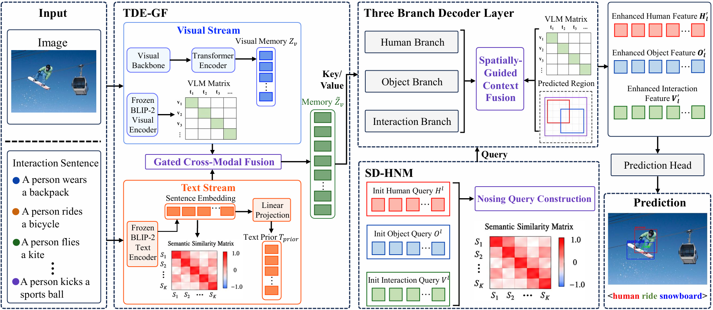
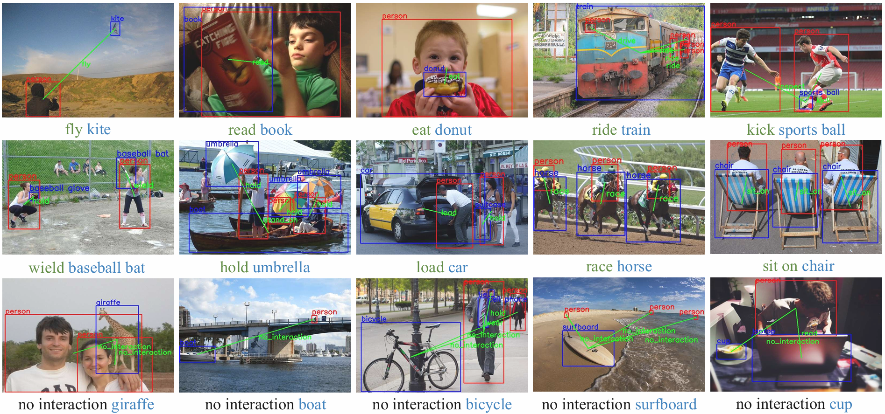

# SPAF-Net

> **Textual Prior Enhancement and Spatially Guided Context Fusion for Human-Object Interaction Detection**

This repository contains the official PyTorch implementation of **Semantic Prior-guided Adaptive Fusion Network (SPAF-Net)** for human-object interaction (HOI) detection. SPAF-Net combines textual priors with visual representations while preserving fine-grained visual evidence for recognizing human-object interactions.

[[Paper](SPAF-Net-PatternRecognition.pdf)]

## Overview

Human-object interaction detection jointly localizes humans and objects and predicts their interactions. SPAF-Net addresses visual ambiguity, long-tailed HOI categories, and background interference through three components:

- **Text-enhanced dual-stream encoder (TDE-GF):** injects frozen textual priors into visual memory using gated residual cross-modal fusion.
- **Semantic denoising human-node mining (SD-HNM):** constructs semantically informed hard negatives from text-derived similarity.
- **Spatially guided context fusion:** uses predicted human and object regions to aggregate relevant VLM features for the human, object, and interaction branches.

## Framework



## Qualitative Results

Examples below show predicted human-object pairs and interactions on HICO-DET. Red boxes denote humans, blue boxes denote objects, and green links denote predicted interactions.



## Results

The accompanying paper evaluates SPAF-Net on **HICO-DET** and **V-COCO**. Under the HICO-DET default setting, SPAF-Net improves Full mAP by **0.41** points over PVIC and by **4.41** points over SCTC++.

For the complete quantitative comparison, ablations, and implementation details, see the [paper](SPAF-Net-PatternRecognition.pdf).

## Installation

The supplied environment targets Linux with Python 3.7, PyTorch 1.12.1, CUDA 11.3, and cuDNN 8.3.

```bash
conda env create -f env.yaml
conda activate muren
```

To use the optional BLIP-2 textual-prior preprocessing script, install the Hugging Face dependencies and place the BLIP-2 OPT-2.7B checkpoint in `BLIP2-opt-2.7b/` (or pass its local path with `--blip2_model_name`).

```bash
pip install transformers
```

## Data Preparation

Download the HICO-DET or V-COCO data and processed annotations, then provide the dataset root with `--hoi_path`. The loaders expect the following layouts:

```text
<HICO-DET_ROOT>/
├── images/
│   ├── train2015/
│   └── test2015/
└── annotations/
    ├── trainval_hico.json
    ├── test_hico.json
    └── corre_hico.npy

<V-COCO_ROOT>/
├── images/
│   ├── train2014/
│   └── val2014/
└── annotations/
    ├── trainval_vcoco.json
    ├── test_vcoco.json
    └── corre_vcoco.npy
```

The repository does not redistribute datasets. Please obtain them from their respective official sources and comply with their licenses.

## Textual Priors

`tools/interaction-prompt.txt`, `tools/interaction-sentence.txt`, and `tools/actions.txt` provide the interaction texts used to construct textual priors. Generate a prior bank with:

```bash
python tools/precompute_text_priors.py \
  --interaction_prompt_file tools/interaction-prompt.txt \
  --interaction_sentence_file tools/interaction-sentence.txt \
  --actions_file tools/actions.txt \
  --output_path pretrained/interaction_text_priors.pt \
  --verb_output_path pretrained/verb_text_priors.pt \
  --blip2_model_name BLIP2-opt-2.7b
```

Load the generated interaction prior bank with `--load_text_priors_path pretrained/interaction_text_priors.pt`.

## Training

Train on HICO-DET:

```bash
python main.py \
  --dataset_file hico \
  --hoi_path /path/to/HICO-DET \
  --output_dir outputs/spaf_hico \
  --batch_size 2 \
  --epochs 100
```

Enable the SPAF-Net modules with the corresponding flags when using a checkpoint or experiment configuration that was trained with them:

```text
--use_early_gated_fusion --use_spatial_qacf --use_asmbr
```

Train on V-COCO:

```bash
python main.py \
  --dataset_file vcoco \
  --hoi_path /path/to/V-COCO \
  --output_dir outputs/spaf_vcoco \
  --num_verb_classes 29 \
  --batch_size 2 \
  --epochs 100
```

## Evaluation

Place a compatible HICO-DET checkpoint at `pretrained/hico-best.pth`, then evaluate it with the same model flags that were used to train the checkpoint:

```bash
python main.py \
  --dataset_file hico \
  --hoi_path /path/to/HICO-DET \
  --resume pretrained/hico-best.pth \
  --eval
```

For V-COCO, add `--dataset_file vcoco --num_verb_classes 29` and provide a compatible V-COCO checkpoint with `--resume`.

`pretrained/` is ignored by default, so release checkpoints through a GitHub Release or another download link rather than committing large model files to the repository.

## Repository Structure

```text
.
├── datasets/              # HICO-DET and V-COCO datasets and evaluation code
├── images/                # Framework and qualitative-result figures
├── models/                # Backbone, transformer, fusion, and HOI model modules
├── pretrained/            # Released checkpoints and generated prior banks
├── tools/                 # Interaction prompts and prior-precomputation utilities
├── main.py                # Training and evaluation entry point
├── engine.py              # Training and evaluation loops
├── env.yaml               # Conda environment specification
└── SPAF-Net-PatternRecognition.pdf
```

## Citation

If you find this project useful, please cite the accompanying paper:

```text
Ke Wang, Yuhao Jiang, Chuang Qiu, and Weilin Gao.
Textual Prior Enhancement and Spatially Guided Context Fusion for
Human-Object Interaction Detection.
```

## Acknowledgements

This implementation builds on the DETR-style HOI detection pipeline and uses the HICO-DET and V-COCO benchmarks.
